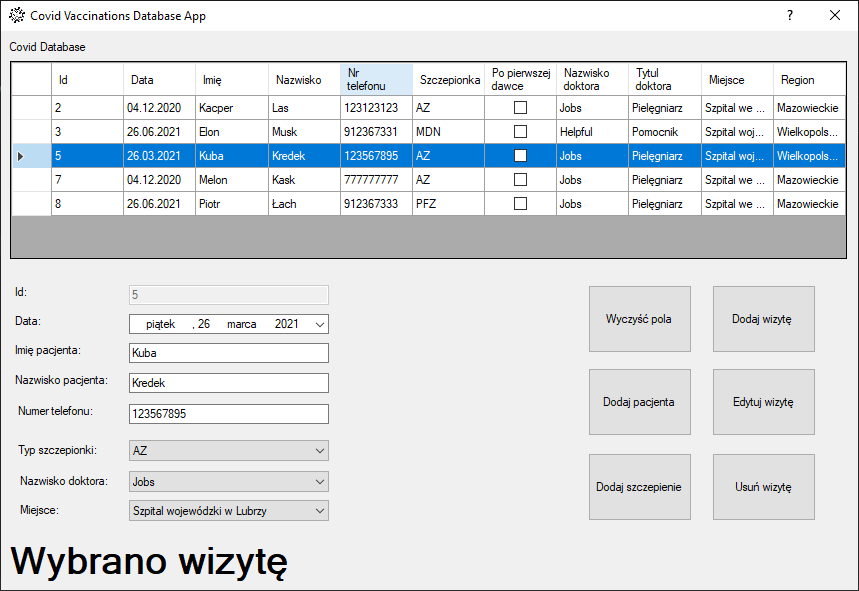
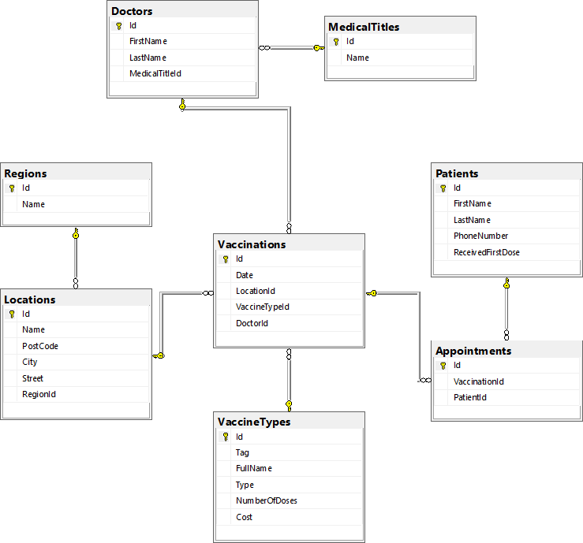

# CovidDatabaseApplication 

A C# application that connects to a SQL database with the usage of a ConnectionString and lets the user display, add, update and delete data from the database. 
I've included the sln file so you can open the project with Visual Studio.

## Preview
 

 

## Database

This application connects to a SQL Database that you can generate with [script.sql](./script.sql) in SQL Managment Studio and host on your device with SQL Server. 
Then connect the application to the database by changing the ConnectionString in Resources.resx. You can read how to do it [here](https://www.connectionstrings.com/sqlconnection/) 
You should end up with a Database that looks like this: 

  

## Kredek Lab2

This application was created as a homework for a university coding club [Kredek](https://www.facebook.com/KNKredek)

